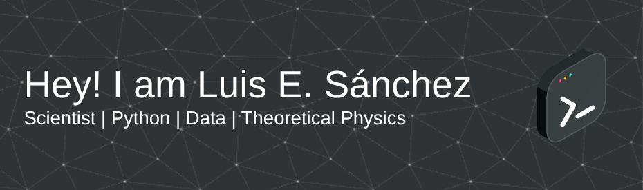

<!--  
 -->

<!--<h2>Hey there! I'm Aditya</h2>-->

<!--# 👋 &nbsp; Hi! I'm Luis Eduardo Sánchez -->

## 👨🏻‍💻 &nbsp;About Me

I’m Luis E. Sánchez-González, a theoretical physicist with a strong background in condensed matter physics. My research focuses on the electronic, optical, and topological properties of two-dimensional Dirac materials, combining analytical, numerical analysis and machine learning techniques.

Alongside my academic work, I’ve developed strong technical skills in Python and C/C++, with experience in scientific computing, data analysis, and numerical modeling. I also enjoy building custom tools for simulation and visualization, and I’m constantly expanding into areas like data science, AI, deep learning, and quantum computing.

Passionate about learning, teaching, and science communication, I’ve taught physics, mathematics, and programming at several levels, and I enjoy creating educational content in Spanish for students in STEM. I’m currently preparing for a PhD and open to opportunities where I can contribute to research, innovation, or tech development, in academia and industry.

Feel free to take a look at my <a href="https://luis2501.github.io/cv/">CV</a>  or explore some of my pinned repositories! I'm open to feedback and suggestions!

<!--💡 &nbsp;I like to explore new technologies and develop software solutions and quick hacks.\
🎓 &nbsp;I'm currently studying Physics Engineering at the Autonomous University of Coahuila.\
🌱 &nbsp;I'm on track for learning more about Artificial Intelligence, Systems Design, and Cloud Architecture.\
✍️ &nbsp;In my free time, I pursue Graphic Design and Blog Writing as hobbies/side hustles.\
💬 &nbsp;Feel free to reach out to me for pro bono consulting and volunteering, or just for some interesting discussion.\
✉️ &nbsp;You can shoot me an email at avsingh@umass.edu! I'll try to respond as soon as I can.\
📄 &nbsp;

-->

<!--
## 🛠 &nbsp; Languages and tools

 &nbsp;
 &nbsp;
 &nbsp;
 &nbsp;
 &nbsp;
 &nbsp;
 &nbsp;
 &nbsp;
 &nbsp;
 &nbsp;
 &nbsp;
 &nbsp; 
 &nbsp;
 &nbsp;
 &nbsp;
 &nbsp;
 &nbsp;
 &nbsp;
-->

## 🛠️ &nbsp; Skills & Tools

**Languages:**  
 &nbsp;
 &nbsp;
 &nbsp;
 &nbsp;
 &nbsp;
 &nbsp;
 &nbsp;
 &nbsp;

**Scientific & Data Tools:**  

**Dev Tools & Others:**  

## ⚙️ &nbsp;GitHub Analytics

<!--

-->

 
  
<b>📊 GitHub Profile Stats</b>

   
  

    
	

	

	  
	

   
  <b>Note:</b> Top languages is only a metric of the languages my public code consists of and doesn't reflect experience or skill level.

  
<b>💻 Recent GitHub Activity</b>

   
   
   

   
<b>📄 Contributions Activity</b>

    
   
    

<!--
## 🎯 &nbsp;Goals for the future...

- 🎓 Begin a PhD in theoretical physics or quantum technologies.
- 🤖 Build a solid portfolio in data science and AI.
- 💡 Develop open-source tools for quantum systems simulation.
- 📚 Launch a YouTube course in LaTeX for STEM students.
- ✍️ Publish at least one first-author paper.
- 🌎 Collaborate on international research or tech development projects.
-->

## 🤝🏻 &nbsp;Connect with Me

<!--

-->

  
  
  
  
  
  

