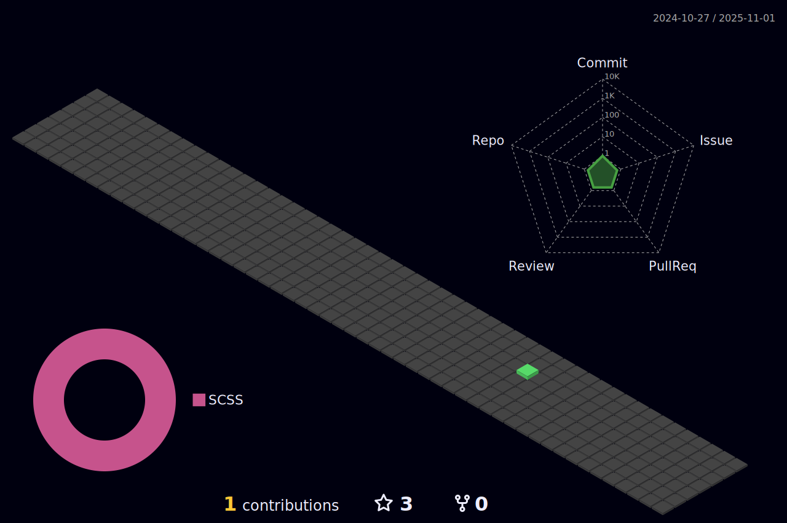

<!-- -->

<!--<h2>Hey there! I'm Aditya</h2>-->

<!--# 👋 &nbsp; Hi! I'm Luis Eduardo Sánchez -->

## 👨🏻‍💻 &nbsp;About Me

I'm currently a student the 8th semester of the Physics Engineering career at Faculty of Physical-Mathematical Sciences of the Universidad Autónoma de Coahuila. I'm interesting on scientific computing, statistics, numerical analysis and computational physics. 

I have strong programming skills in Python and C/C++. I have some knowledge in other languages and mathematical softwares such as Fortran, Julia, Java Script, Mathematica and Matlab. Also I have considerable knowledge of web development and graphics user interfaces development. In adittion, I have good knowledge in tools for data science, data analysis and IA, but in these areas I still consider myself a beginner. 

I keep on learning continuously and I like to share with others what I have learnt. Please have a look at my <a href="https://luis2501.github.io/cv/">CV</a> for more details about me. I'm open to feedback and suggestions!

<!--💡 &nbsp;I like to explore new technologies and develop software solutions and quick hacks.\
🎓 &nbsp;I'm currently studying Physics Engineering at the Autonomous University of Coahuila.\
🌱 &nbsp;I'm on track for learning more about Artificial Intelligence, Systems Design, and Cloud Architecture.\
✍️ &nbsp;In my free time, I pursue Graphic Design and Blog Writing as hobbies/side hustles.\
💬 &nbsp;Feel free to reach out to me for pro bono consulting and volunteering, or just for some interesting discussion.\
✉️ &nbsp;You can shoot me an email at avsingh@umass.edu! I'll try to respond as soon as I can.\
📄 &nbsp;

-->

## 🛠 &nbsp; Languages and tools

 &nbsp;
 &nbsp;
 &nbsp;
 &nbsp;
 &nbsp;
 &nbsp;
 &nbsp;
 &nbsp;
 &nbsp;
 &nbsp;
 &nbsp;
 &nbsp; 
 &nbsp;
 &nbsp;
 &nbsp;
 &nbsp;
 &nbsp;
 &nbsp;

## ⚙️ &nbsp;GitHub Analytics

<!--

-->

 
  
<b>📊 GitHub Profile Stats</b>

   
  

    
	

	

	  
	

   
  <b>Note:</b> Top languages is only a metric of the languages my public code consists of and doesn't reflect experience or skill level.

  
<b>💻 Recent GitHub Activity</b>

   
   
   

   
<b>Contributions Activity</b>

    
   
    

## 🤝🏻 &nbsp;Connect with Me

<!---->

